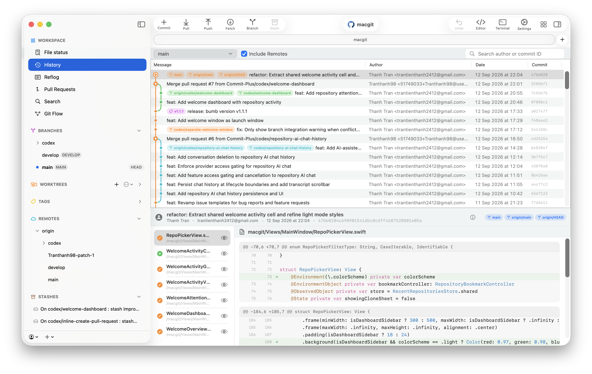

<p align="center">
  
</p>

<p align="center">
  <h1 align="center">Commit+</h1>
</p>

<p align="center">
  A fast, native Git client for macOS.<br>
  Free and open source.
</p>

<p align="center">
  <a href="https://github.com/Commit-Plus/macgit/releases/latest"></a>
  <a href="https://github.com/Commit-Plus/macgit/releases/latest"></a>
  <a href="https://img.shields.io/badge/macOS-26.2%2B-blue"></a>
  <a href="https://www.gnu.org/licenses/agpl-3.0"></a>
</p>

---

<p align="center">
  <picture>
    <source media="(prefers-color-scheme: dark)" srcset=".github/assets/dark-commit-plus.png">
    <source media="(prefers-color-scheme: light)" srcset=".github/assets/commit-plus.png">
    
  </picture>
</p>

Commit+ is a native macOS Git client built with Swift and SwiftUI — designed to be fast, lightweight, and deeply integrated with the platform. Optional account features add sync, updates, and AI-powered commit messages.

## Why Commit+

macOS Git clients today fall into three groups:

- **Command line**: Powerful but requires memorizing dozens of commands and flags.
- **Electron-based**: SourceTree, GitKraken, Fork. Cross-platform but not native — slow to start, heavy on memory, inconsistent with macOS conventions.
- **Proprietary**: Tower. Polished and native, but paid and closed source.

Commit+ is the missing fourth: native, lightweight, and open source.

## Features

### Drag & Drop

Complex Git actions become effortless with drag and drop:

- **Reorder / Squash Commits**: Drag commits in the history view to reorder, squash, or fixup (interactive rebase)
- **Cherry-Pick / Revert**: Drag commits between branches to cherry-pick; hold ⌥ to revert
- **Merge / Rebase Branches**: Drag a branch onto HEAD to merge; hold ⌥ to rebase instead
- **Push / Pull Branches**: Drag branches to the remote section to publish or pull
- **Stage / Stash Files**: Drag files between working copy, staged, and stash views
- **Apply Stashes**: Drag a stash or individual file back to the working copy to apply

### Undo Any Action

Tower-style undo/redo for stage/unstage, commits, stashes, branch operations, discards, and remote actions. Press `Cmd+Z` to undo, `Cmd+Shift+Z` to redo.

### Full Git Management

Commit, Pull, Push, Fetch, Branch, Merge, Rebase, Stash, Cherry-pick, Revert, Reset — all with keyboard shortcuts.

### Built-in Conflict Resolution

Visual diff viewer with inline conflict markers, stage resolution, and abort merge/rebase — resolve conflicts without leaving the app.

### Smarter Worktree Management

Create, switch, and remove git worktrees from the sidebar for isolated parallel feature work, all managed visually.

### Git Flow

Repository-aware Git Flow without requiring the external `git-flow` command:

- **One-click setup**: Detect `main`/`master` and `develop`, then customize branch names and prefixes per repository
- **Start topics**: Create `feature/`, `bugfix/`, `release/`, and `hotfix/` branches from the right base branch
- **Worktree-aware starts**: Start a topic in the current working copy or a new worktree
- **Finish topics**: Finish with merge commits or rebase-and-fast-forward, with release/hotfix tag options
- **Recovery controls**: Resume or abort interrupted finish flows after conflicts or partial operations
- **Cross-Mac configuration sync**: Signed-in users can sync durable Git Flow settings for the same remote repository while keeping paths, worktrees, credentials, and recovery state local

### AI Commit Generation

Generate editable Conventional Commit messages from your staged diff, or from changed files when nothing is staged:

- **Provider choices**: Apple Intelligence, OpenAI, Google Gemini, Claude, DeepSeek, and OpenRouter
- **Private local option**: Apple Intelligence runs on-device when supported and enabled on your Mac
- **BYOK cloud providers**: Store API keys in macOS Keychain and configure model IDs in Settings
- **Context-aware output**: Uses file lists, line stats, patch context, branch name, and recent commit subjects
- **Safe handoff**: Generated messages stay editable before committing, and Commit+ asks you to regenerate if the underlying changes move during generation

### Terminal Integration

Open any repository directly from the terminal with the `commit` CLI command:

```sh
commit                  # Open the current folder's repository
commit .                # Same behavior
commit "/path/to/repo"   # Open a specific repository
commit --help
```

On first launch, Commit+ offers to **Install CLI & Configure PATH** — this creates a `commit` symlink at `~/.local/bin/commit` and adds it to your shell configuration (zsh, bash, or fish). You can also install later from **Settings → General → Command Line**.

The command opens the repository in Commit+ (it does not create a Git commit). Subfolders resolve to the working-tree root, and linked worktrees are supported. To uninstall, remove `~/.local/bin/commit`.

### Quick Search

Spotlight-style search modal (`Cmd+Shift+F`) to instantly find commits, files, branches, and tags.

## System Requirements

- **macOS**: 26.2+
- **Xcode**: 26.2+ (to build from source)
- **Git**: Installed on the system (Homebrew or Xcode Command Line Tools)

## Keyboard Shortcuts

| Shortcut | Action |
|----------|--------|
| `Cmd+Shift+C` | Commit |
| `Cmd+Shift+P` | Pull |
| `Cmd+Option+P` | Push |
| `Cmd+Option+F` | Fetch |
| `Cmd+Shift+B` | Branch |
| `Cmd+Shift+M` | Merge |
| `Cmd+Shift+S` | Stash |
| `Cmd+Shift+F` | Search |

## Contributing

We welcome contributions! Please see [CONTRIBUTING.md](CONTRIBUTING.md) for setup instructions, coding conventions, and pull request guidelines.

For security issues, please refer to [SECURITY.md](SECURITY.md).

## License

This project is licensed under the [GNU Affero General Public License v3.0 (AGPLv3)](LICENSE).
